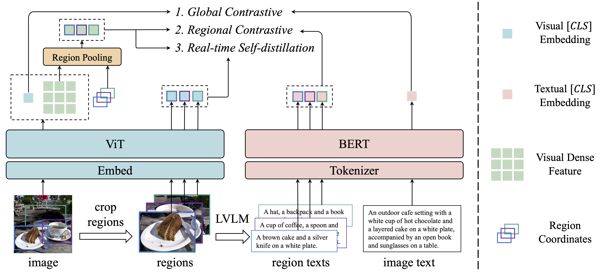

# FineCLIP

## Introduction

Official Release of FineCLIP: Self-distilled Region-based CLIP for Better Fine-grained Understanding **(NIPS2024)**

> [**FineCLIP: Self-distilled Region-based CLIP for Better Fine-grained Understanding**](https://openreview.net/pdf?id=nExI4FuKWD),            
> Dong Jing*, Xiaolong He*, Yutian Luo, Nanyi Fei, Guoxing Yang, Wei Wei, Huiwen Zhao, Zhiwu Lu†



## TODO
- [x] Code for training and evaluating FineCLIP on COCO dataset
- [ ] Data generation pipeline of CC2.5M

## Environment

```bash
conda create -n fineclip python=3.8
conda activate fineclip
pip install -r requirements.txt
```

## Data Preparation

The main ablation experiments are conducted using images from [COCO](https://cocodataset.org/#home) 
and [Flickr](https://shannon.cs.illinois.edu/DenotationGraph/) datasets. Please donwload and organize datasets like the following:

```text
FineCLIP/
├── data
    ├── coco
        ├── annotations
            ├── captions_train2017.json [Image Captions](https://drive.google.com/file/d/1gV7MZxQCkRbmC__FcVr0rGuNIdpacnwJ/view?usp=drive_link)
            ├── instances_train2017.json 
            ├── panoptic_val2017.json
            ├── panoptic_val2017 
        ├── train2017
        ├── val2017
        ├── coco_captions.json  [Region Captions](https://drive.google.com/file/d/1hmXjZ1i8LMTkKg6JPnU5qfT1pIMulFqA/view?usp=drive_link)
        ├── coco_proposals.json
        ├── coco_test.json      [Test Data](https://drive.google.com/file/d/1Qdqe8fINH79A53nb7D81KYski7iLsWyV/view?usp=drive_link)
    ├── flickr30k
        ├── flickr30k_images
        ├── flickr30k_test.json [Test Data](https://drive.google.com/file/d/1zluOdlZ9JJL0XufMIw6i6ls0iW2EXYPf/view?usp=drive_link)
```

##  Original Models 
To run FineCLIP, first obtain the original models from 
[EVA-02-CLIP](https://github.com/baaivision/EVA/tree/master/EVA-CLIP), and put them under 
`checkpoints/` like the following:

```text
FineCLIP/
├── checkpoints
    ├── EVA02_CLIP_B_psz16_s8B.pt
    ├── EVA02_CLIP_L_336_psz14_s6B.pt
```


## Start Training

After preparing data and model, we can start train FineCLIP by running scripts under [scripts/](scripts).

If you want to train FineCLIP of ViT-B/16 on COCO, please run:
```bash
bash scripts/train_vitb16.sh
```

If you want to train FineCLIP of ViT-L/14 on COCO, please run:
```bash 
bash scripts/train_vitl14.sh
```


## Evaluation

We provide the scripts to evaluate FineCLIP under [scripts/](scripts), they are summarized as follows:

|  #  | Model Type |          Task           |   Benchmark   |                  script                  |
|:---:|:----------:|:-----------------------:|:-------------:|:----------------------------------------:|
|  1  |  ViT-B/16  |   Box Classification    | COCO Panoptic |   [script](scripts/test_vitb16_box.sh)   |
|  2  |  ViT-B/16  |  Image-text Retrieval   |    MSCOCO     | [script](scripts/test_vitb16_mscoco.sh)  |
|  3  |  ViT-B/16  |  Image-text Retrieval   |  Flicker30K   | [script](scripts/test_vitb16_flickr.sh)  |
|  4  |  ViT-L/14  |   Box Classification    | COCO Panoptic |   [script](scripts/test_vitl14_box.sh)   |
|  5  |  ViT-L/14  |  Image-text Retrieval   |    MSCOCO     | [script](scripts/test_vitl14_mscoco.sh)  |
|  6  |  ViT-L/14  |  Image-text Retrieval   |  Flicker30K   | [script](scripts/test_vitl14_flickr.sh)  |


## FineCLIP Checkpoints

We provide FineCLIP checkpoints trained on COCO :)

[FineCLIP_coco_vitb16.pt](https://drive.google.com/file/d/119eeWzjsE2rpUFBs2rDMZ7QlK1RxZYL2/view?usp=drive_link) 

[FineCLIP_coco_vitl14.pt](https://drive.google.com/file/d/1lSIj5tWVVNVFNzuPHisOAdDQyCXWIzUH/view?usp=drive_link)

## Downstream Evaluations

If you want to evaluate FineCLIP on downstream tasks like open-vocabulary object detection and segmention, please refer to [CLIPSelf](https://github.com/wusize/CLIPSelf/tree/main) and [CAT-Seg](https://github.com/cvlab-kaist/CAT-Seg).
We thank their valuable code bases.

## Citation

```bibtex
@article{fineclip,
  title={FineCLIP: Self-distilled Region-based CLIP for Better Fine-grained Understanding},
  author={Dong Jing, Xiaolong He, Yutian Luo, Nanyi Fei, Guoxing Yang, Wei Wei, Huiwen Zhao, Zhiwu Lu},
  journal={Advances in Neural Information Processing Systems},
  year={2024}
}
```

## Acknowledgement

We sincerely thank the following excellent works:
[CLIPSelf](https://github.com/wusize/CLIPSelf/tree/main),
[RegionCLIP](https://github.com/microsoft/RegionCLIP),
[OpenCLIP](https://github.com/mlfoundations/open_clip/tree/v2.16.0),
[EVA-CLIP](https://github.com/baaivision/EVA/tree/master/EVA-CLIP).

## License

<a rel="license" href="https://creativecommons.org/licenses/by-nc-nd/4.0/"></a>
